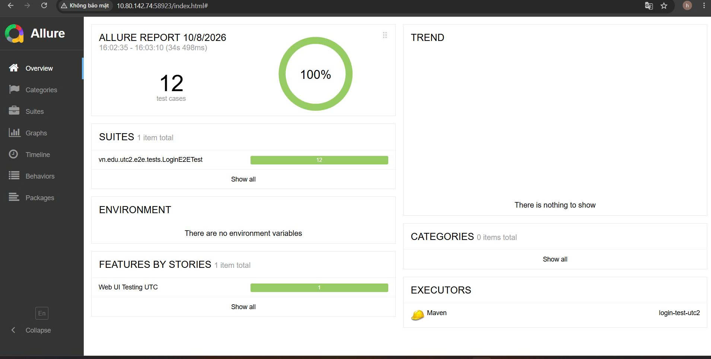

# BÁO CÁO BÀI TẬP KIỂM THỬ TỰ ĐỘNG (AUTOMATION TESTING)

## THÔNG TIN SINH VIÊN & HỌC PHẦN
* **Họ và tên:** Nguyễn Văn Hưng
* **Mã số sinh viên (MSSV):** 6451071029
* **Môn học:** Kiểm thử phần mềm
* **Đề tài:** Kiểm thử tự động giao diện Web (Web UI Automation Testing) cho cổng Đăng nhập Văn phòng điện tử Trường Đại học Giao thông Vận tải Phân hiệu tại TP.HCM (UTC2)
* **Target URL:** `https://vanphongdientu.utc.edu.vn/Login`

---

## 1. GIỚI THIỆU TỔNG QUAN
Dự án thực hiện xây dựng bộ kiểm thử giao diện tự động (End-to-End Test) áp dụng mô hình kiến trúc chuẩn công nghiệp **Page Object Model (POM)**. Toàn bộ kịch bản kiểm thử được thiết kế nhằm tự động hóa các trường hợp xác thực, kiểm tra biên, an toàn dữ liệu và điều hướng trên hệ thống thực tế của trường UTC. Kết quả kiểm thử được tự động tổng hợp trực quan qua **Allure Report**.

---

## 2. CÔNG NGHỆ & THƯ VIỆN SỬ DỤNG
* **Ngôn ngữ lập trình:** Java (phiên bản 17+ / 21 / 25)
* **Framework kiểm thử:** JUnit 5 (JUnit Jupiter)
* **Công cụ tự động hóa UI:** Selenium WebDriver (v4.25.0 / 4.43.0)
* **Báo cáo kiểm thử:** Allure Report Framework & Allure Maven Plugin
* **Quản lý build & dependencies:** Apache Maven
* **Trình duyệt thực thi:** Google Chrome & ChromeDriver

---

## 3. CẤU TRÚC DỰ ÁN (PAGE OBJECT MODEL - POM)
Dự án được phân tách cấu trúc mô-đun rõ ràng theo chuẩn mô hình POM:

```text
login-test-utc2/
├── src/
│   └── test/
│       └── java/
│           └── vn/edu/utc2/
│               └── e2e/
│                   ├── base/
│                   │   ├── BaseTest.java        # Quản lý vòng đời WebDriver (@BeforeEach, @AfterEach)
│                   │   └── BasePage.java        # Đóng gói Explicit Wait, click, type an toàn
│                   ├── pages/
│                   │   └── LoginPage.java       # Định vị phần tử DOM và hành vi trên trang đăng nhập
│                   └── tests/
│                       └── LoginE2ETest.java    # Kịch bản kiểm thử E2E tương ứng 12 test cases
├── pom.xml                                      # Cấu hình dependencies (Selenium, JUnit 5, Allure)
└── README.MD

```

## 4. DANH SÁCH CÁC KỊCH BẢN KIỂM THỬ (TEST CASES)

| Mã TC | Tên kịch bản | Tên phương thức | Các bước kiểm thử (Steps) | Kết quả mong đợi (Expected Output) |
| :---: | :--- | :--- | :--- | :--- |
| **TC1** | Bỏ trống Username | `test_TC1_emptyUsername()` | 1. Để trống ô username<br>2. Nhập password: `1256`<br>3. Bấm Đăng nhập | Hệ thống chặn lại, giữ nguyên tại trang `/Login` |
| **TC2** | Bỏ trống Password | `test_TC2_emptyPassword()` | 1. Nhập username: `huongnt`<br>2. Để trống ô password<br>3. Bấm Đăng nhập | Hệ thống chặn lại, giữ nguyên tại trang `/Login` |
| **TC3** | Đúng user, sai mật khẩu | `test_TC3_wrongPassword()` | 1. Nhập username: `huongnt`<br>2. Nhập password: `utc@235`<br>3. Bấm Đăng nhập | Báo lỗi đăng nhập, giữ nguyên tại trang `/Login` |
| **TC4** | Sai user, đúng mật khẩu | `test_TC4_wrongUsername()` | 1. Nhập username: `huongthunguyen`<br>2. Nhập password: `123456@utc`<br>3. Bấm Đăng nhập | Từ chối xác thực, giữ nguyên tại trang `/Login` |
| **TC5** | Tương tác Checkbox Ghi nhớ | `test_TC5_rememberMeCheckbox()` | 1. Click chọn nhãn `Giữ tôi luôn đăng nhập` | Checkbox chuyển sang trạng thái đã chọn (`isSelected = true`) |
| **TC6** | Trạng thái mặc định Checkbox | `test_TC6_withoutRememberMe()` | 1. Tải trang đăng nhập<br>2. Kiểm tra trạng thái ban đầu của ô checkbox | Checkbox mặc định không được chọn (`isSelected = false`) |
| **TC7** | Để trống cả 2 trường | `test_TC7_emptyBothFields()` | 1. Để trống cả user và pass<br>2. Bấm Đăng nhập | Hệ thống chặn lại, giữ nguyên tại trang `/Login` |
| **TC8** | Username khoảng trắng | `test_TC8_whitespaceUsername()` | 1. Nhập username: `   `<br>2. Nhập password: `123456@utc`<br>3. Bấm Đăng nhập | Xử lý khoảng trắng, giữ nguyên tại trang `/Login` |
| **TC9** | Phân biệt hoa/thường mật khẩu | `test_TC9_caseSensitivePassword()` | 1. Nhập username: `huongnt`<br>2. Nhập password: `123456@UTC`<br>3. Bấm Đăng nhập | Phân biệt chữ hoa/thường, từ chối đăng nhập |
| **TC10**| Phòng chống SQL Injection | `test_TC10_sqlInjectionPrevention()` | 1. Nhập username & password: `' OR '1'='1`<br>2. Bấm Đăng nhập | Hệ thống an toàn, không bị bypass qua câu lệnh SQL |
| **TC11**| Kiểm tra bảo mật mật khẩu | `test_TC11_passwordMasking()` | 1. Nhập mật khẩu vào ô password<br>2. Kiểm tra thuộc tính thẻ input | Thuộc tính `type="password"`, ký tự được ẩn giấu |
| **TC12**| Điều hướng Quên mật khẩu | `test_TC12_forgotPasswordLinkNavigation()` | 1. Bấm vào liên kết `Bạn quên mật khẩu đăng nhập ?` | Chuyển hướng chính xác sang URL `/Login/GetPass` |

---

## 5. HƯỚNG DẪN THỰC THI KIỂM THỬ (AUTOMATION TEST)

Mở Terminal tại thư mục gốc dự án (`login-test-utc2`) và thực hiện:

### 5.1. Chạy toàn bộ 12 test cases
```bash
./mvnw clean test
```
### 5.2. Chạy riêng lẻ một test case bất kỳ
* Chạy riêng TC1:
  ```bash
  ./mvnw test -Dtest=LoginE2ETest#test_TC1_emptyUsername
  ```

## 6. HƯỚNG DẪN XEM BÁO CÁO ALLURE REPORT

Dự án đã tích hợp sẵn `allure-maven` plugin trong file `pom.xml`, không yêu cầu cài đặt Allure CLI riêng.

### 6.1. Khởi chạy Dashboard Allure trên trình duyệt
Chạy lệnh sau trên Terminal:
```bash
./mvnw allure:serve

```
<p align="center">
  
</p>